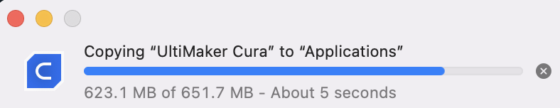

# Cura Slicer for Sovol 3D Printers

 

### Cura Version 5 + Sovol SV06 Plus

Official Website: https://sovol3d.com/products/sovol-sv06-plus


#### [Tested] on The Following Computer Systems

- [x] MacOs Ventura 13.3,  Apple M2
- [x] Windows 10
- [x] Windows 11

###  Mac Setup and Install (Tutorial)

For this tutorial we will begin by installing the latest version of cura, which is version 5.

- [Install Cura](#install_cura)
- [Adding the Sovol SV06 Plus Printer Profile](#add_sv06_plus)

<h3 id="install_cura">Install Cura</h3>

1. Go to: https://ultimaker.com/
2. In the navigation hover over: <span color="blue">Software</span> and select: UltiMaker Cura


3. Next, select the **Download For Free** button.


4. Select your operating system. For this tutorial select: **Mac OS, 64 bit**

5. It should begin downloading a **.dmg** file titled: `UltiMaker-Cura-#.#.#-mac.dmg`. The `#.#.#` will be the software version number like: _5.3.1_

6. Double-click on the **.dmg** file to install it.

7. A window will pop-up. Agree to the terms and continue the installation.


8. Drag Ultimker Cura to the Applications Folder in the next pop-up window.


9. You may see a progress bar, depending on the speed of your computer.



10. Close the installation pop-up windows from step 8.

11. Open the **UltiMaker Cura** application

12. You may get a pop-up asking if you really want to open Cura. Stating, it is an app downloaded from the Internet. Click: **Open**


13. The first time you open **Cura** up you will likely see a **Get Started** button.

14. Click it and Agree!

15. Click Next.

16. Finally, Ultimaker will ask if you want to **[Skip]**, **[Create a free Ultimaker Account]**, or **[Sign In]**. For this tutorial we will be selecting **[Skip]** for now.


17. Next, it will ask you to **Add Printer**. Since we haven't imported the profile configuration file for the **SVO6 Plus**, we will just create a temporary custom printer.

18. Select: **Non UltiMaker Printer**


19. This time, select: **Add a non-networked printer**


20. Next, you will see a list of brands with **UltiMaker** selected. Scroll-down to the next brand which is **Custom** and select: **Custom FFF**


21. Don't name this printer because we will be removing it once we have added the SV06 Plus printer. For now, click: **[Next]**

22. For the **Machine Settings** click **[Next]**

23. Click **Skip** for **What's New**

24. Finally, select: **[Finish]**

25. You should now see the **Cura** application window. Something like the screenshot below.


<h2 id="add_sv06_plus"> + Adding the Sovol SV06 Plus Printer Profile</h2>

First off, I want to say thank you to the reddit user: <a href="https://www.reddit.com/user/vgergo/"  target="_blank">vgergo</a> for providing the files and the original instruction. <a href="https://www.reddit.com/r/Sovol/comments/12ycn1g/tip_this_is_how_you_can_import_sovol_slicers_sv06/" target="_blank">Original Reddit Post</a> - He made a [detailed tutorial](https://www.youtube.com/embed/VULBzpPf0Yg) to better understand Cura and Profiles as well.


<hr />

For Apple/Mac use the following step-by-step guide.

1. Download the following zip folder: [Sovol SV06 Plus Configuration Files.zip](./sovol-SV06-plus-config_files.zip)

2. Now extract/unzip the folder. The extracted folder should contain the following folders and files.

```bash
definition > SV06_Plus.def.json
extruders  > SV06_extruder_0.def.json
images     > sovolbackplate.png
meshes     > sovol_300_300_platform.obj
```

3. Make sure Cura is running / open.

4. In the top navigation find and select: **Help**

5. A drop-down will appear. Select: **Show Configuration Folder**


6. You should now see the directory where all your Cura configuration files are stored.
> **!!! DONT DELETE ANYTHING - UNLESS YOU WAN TO RE-INSTALL CURA AGAIN !!!**

7. Move your extracted/unzipped folder next to the Cura configuration folder.


8. Next, Either Drag-n-Drop the files or Copy and Paste them.

```bash
COPY  'SV06_Plus.def.json' to '/definitions/'
COPY  'SV06_extruder_0.def.json' to '/extruders/'
```


```bash
# The images and meshes folders do not exist until you copy them over.

COPY  '/images' to '/5.3/images'
COPY  '/meshes' to '/5.3/meshes'
```

9. Close the **Cura** application and then open it back up.

10. Let's + add a new **Sovol SV06 Plus** printer. We can do this two ways. Either click on the **[Custom]** button or in the top navigation select: **Settings** > **Printer** > **Add Printer**


11. Now just like before select:

- Non UltiMaker printer
- Add a non-networked printer

12. This time, when you see the list, **instead** scroll-down until you see the brand **sovol** and expand it. You should now see the **Sovol-SV06 Plus** in the list of printers.


13. Selecting it will give it the same name. Then click **[Add]**

14. You should now see a custom build platform that looks similar to the **Sovol SV06 Plus** and the correct dimensions. See the screenshot below.
> _Note: we weren't able to display the Sovol logo on the back plate of the printing platform in Cura... on a Apple Silicon M2_


# Testing the Cura Software Configuration

Tried to modify the values displayed for the infill pattern to include an icon. Initial tests using the apple glyphicons was successful. These findings confirmed that the only way to go about creating custom icons that represented the text would be to create a custom .ttf font file using font glyphicons. Current attempts have not been successful and further study into the software is necessary.

```json
"infill_pattern": {
    "options": {
        "grid": "Grid",
        "lines": "Lines",
        "triangles": "Triangles",
        "trihexagon": "Tri-Hexagon",
        "cubic": "Cubic",
        "cubicsubdiv": "Cubic Subdivision",
        "tetrahedral": "Octet",
        "quarter_cubic": "Quarter Cubic",
        "concentric": "Concentric",
        "zigzag": "Zig Zag",
        "cross": "Cross",
        "cross_3d": "Cross 3D",
        "gyroid": "Gyroid",
        "lightning": "Lightning"
    },
},
```